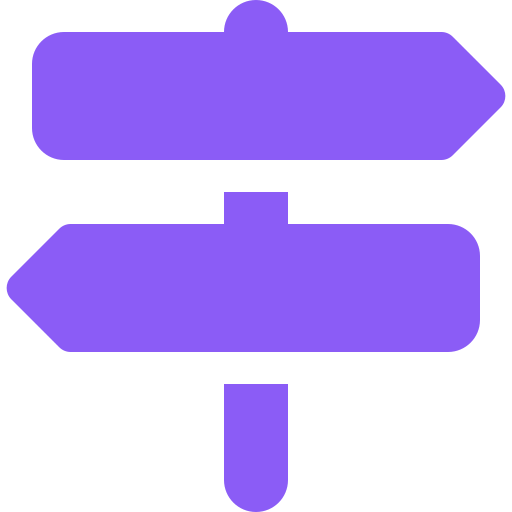
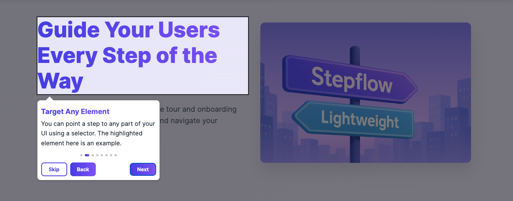

<h1>
  
  Stepflow
</h1>

[](https://www.npmjs.com/package/@mohamedelghandour/stepflow)
[](https://www.npmjs.com/package/@mohamedelghandour/stepflow)
[](https://bundlephobia.com/package/@mohamedelghandour/stepflow)
[](https://mohamedelghandour.github.io/Stepflow/demo/)
[](https://github.com/MohamedElGhandour/Stepflow/stargazers)
[](./LICENSE)

> Product tours and onboarding walkthroughs for React. One component, 3.2 kB min+gzip, zero runtime dependencies.



Live demo: https://mohamedelghandour.github.io/Stepflow/demo/

---

## Install

```bash
npm i @mohamedelghandour/stepflow
```

Requires React 18 or 19. React and React DOM are peer dependencies — Stepflow adds no runtime dependencies of its own.

## Quick start

```tsx
import { useRef, useState } from "react";
import { Stepflow, type Step } from "@mohamedelghandour/stepflow";
import "@mohamedelghandour/stepflow/styles.css";

export function App() {
  const saveRef = useRef<HTMLButtonElement>(null);
  const [run, setRun] = useState(false);

  const steps: Step[] = [
    { title: "Welcome", content: "Let's walk through the editor." },
    { target: saveRef, title: "Save", content: "Your work is saved here." },
    { target: "#sidebar", title: "Sidebar", content: "Everything else lives here." },
  ];

  return (
    <>
      <button onClick={() => setRun(true)}>Start tour</button>
      <button ref={saveRef}>Save</button>
      <aside id="sidebar">…</aside>

      <Stepflow steps={steps} run={run} onComplete={() => setRun(false)} onCancel={() => setRun(false)} />
    </>
  );
}
```

Three things worth knowing up front:

- **`run` is yours to control.** Stepflow renders nothing while it is false. Flip it back in `onComplete` / `onCancel`.
- **Targets take a ref, a selector, or nothing.** A ref survives refactors; a step with no target is centered, which is what you want for an intro or an outro.
- **`content` is a React node.** Pass JSX, components, translated strings — anything. There is no HTML-string escape hatch, so there is no XSS surface.

## Props

| Prop | Type | Default | Notes |
| --- | --- | --- | --- |
| `steps` | `Step[]` | — | Required. |
| `run` | `boolean` | `false` | The tour is mounted while true. |
| `labels` | `{ next, prev, cancel, complete }` | `Next` / `Back` / `Skip` / `Done` | |
| `showPrev` / `showCancel` | `boolean` | `true` | |
| `overlay` | `boolean \| { opacity, closeOnClick }` | `true`, `0.3`, `false` | `false` keeps the ring, drops the dimming. |
| `highlightColor` | `string` | `rgba(0, 0, 0, 0.8)` | |
| `keyboard` | `boolean` | `true` | Arrow keys. Ignored while focus is in a text field. |
| `escapeToCancel` | `boolean` | `true` | |
| `lockScroll` | `boolean` | `true` | |
| `progress` | `"dots" \| "counter" \| "of" \| "percentage" \| "none" \| (current, total) => ReactNode` | `"dots"` | |
| `progressPosition` | `"header" \| "body" \| "inline"` | `"body"` | |
| `scrollBehavior` | `ScrollBehavior` | `"smooth"` | Passed to `scrollIntoView`. |
| `className` | `string` | — | Added to the card. |
| `container` | `HTMLElement \| null` | `document.body` | Portal host. |

Callbacks: `onStart`, `onStepChange`, `onNext`, `onPrev`, `onComplete`, `onCancel`, `onError`. Each receives `(step, index)`. `onNext` / `onPrev` may return a promise — the controls disable themselves until it settles, and throwing aborts the move.

Per-step: `target`, `title`, `content`, `onNext`, `onPrev`.

## Headless

`useTour` is the state machine without the UI, for a fully custom card:

```tsx
import { useTour } from "@mohamedelghandour/stepflow";

const tour = useTour(steps, run, { onComplete: () => setRun(false) });
// tour.step, tour.index, tour.isFirst, tour.isLast, tour.busy
// tour.next(), tour.prev(), tour.complete(), tour.cancel()
```

## Documentation

📚 Full documentation: [./doc/README.md](./doc/README.md)

- Getting started: [./doc/getting-started/quick-start.md](./doc/getting-started/quick-start.md)
- Configuration: [./doc/guides/configuration.md](./doc/guides/configuration.md)
- API reference: [./doc/api/index.md](./doc/api/index.md)
- Styling and theming: [./doc/guides/styling-and-theming.md](./doc/guides/styling-and-theming.md)
- Migrating from 1.x: [./MIGRATION.md](./MIGRATION.md)

## Requirements

- React 18 or 19, and a real browser DOM.
- Safe to import in SSR (Next.js, Remix, Astro): the component renders `null` on the server and every DOM read happens inside an effect.

## Contributing

See [./doc/developers/contributing.md](./doc/developers/contributing.md).

## License

MIT. See [./LICENSE](./LICENSE).
